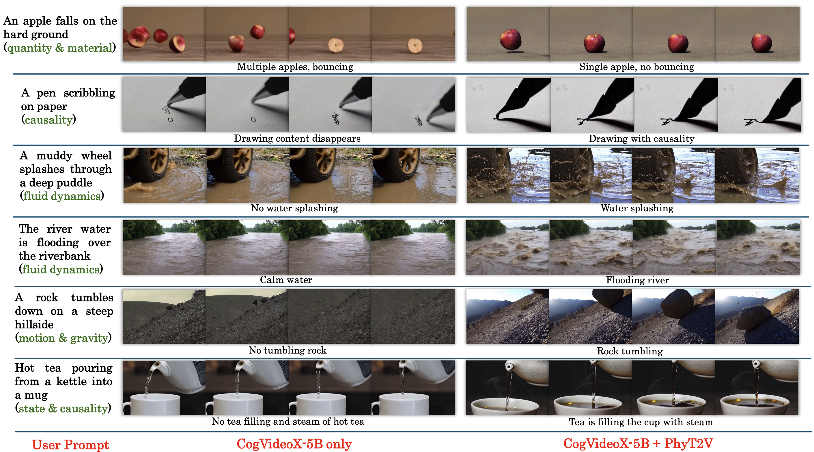

# PhyT2V
This repository is the official implementation of [PhyT2V](https://arxiv.org/pdf/2412.00596). 

> [PhyT2V: LLM-Guided Iterative Self-Refinement for Physics-Grounded Text-to-Video Generation](https://arxiv.org/pdf/2412.00596)  
> Qiyao Xue, Xiangyu Yin, Boyuan Yang, Wei Gao 

## 💡 News
- `2024/2/26`: PhyT2V has been accepted to [CVPR 2025](https://cvpr.thecvf.com/).
- `2024/11/31`: We have released the code. 

## 🎩Introduction 

Text-to-video (T2V) generation has been recently enabled by transformer-based diffusion models, but current T2V models lack capabilities in adhering to the real-world common knowledge and physical rules, due to their limited understanding of physical realism and deficiency in temporal modeling. Existing solutions are either data-driven or require extra model inputs, but cannot be generalizable to out-of-distribution domains. In this paper, we present PhyT2V, a new data-independent T2V technique that expands the current T2V model's capability of video generation to out-of-distribution domains, by enabling chain-of-thought and step-back reasoning in T2V prompting. Our experiments show that PhyT2V improves existing T2V models' adherence to real-world physical rules by 2.3x, and achieves 35\% improvement compared to T2V prompt enhancers.


## 📖PhyT2V

The primary objective of our PhyT2V design is to guide a well-trained LLM (e.g., ChatGPT-4o) to generate a refined prompt that enables the pre-trained T2V model to generate videos that better match the given user prompt and real-world physical rules, and the refined prompt will be iteratively used as the new user prompt in the next round of refinement. To ensure proper identification in the parallel subproblems and prompt generation in the final subproblem, the core of PhyT2V design is two types of LLM reasoning processes within the prompt enhancement loop: the local CoT reasoning for individual subproblems and global step-back reasoning for the overall prompt refinement problem.


## ✨Examples

Here are some example showcase on the physcial-grounded video generation w and w/o PhyT2V



## 🚀 Quick Start

### Environment

```bash
git clone git@github.com:pittisl/PhyT2V.git
cd PhyT2V
conda env create -f environment.yaml
conda activate PhyT2V
```

### Model
The CogVideo-5B model is used for generating the video, Tarsier is used to generate the video caption and videocon is used for generate the video evaluation score. Before inferencing the related model weights are required to be download and place in the following addresses:
- [CogVideo-5B](https://huggingface.co/THUDM/CogVideoX-5b): the model weight address is ```.\CogVdoepX-5b```
- [Tarsier-34B](https://huggingface.co/omni-research/Tarsier-34b): the model weight address is ```.\tarsier\Tarsier-34b```
- [videocon-physics](https://huggingface.co/videophysics/videocon_physics): the model weight address is ```.\videophy\videocon_physics``` 

### Inference

The user input prompt should be placed in the ```.\prompt.txt``` file and run the following command with a usable gpt api key input and a desired prompt refinement round number input

```bash
bash inference.sh --round_num <desired prompt refinement round number> --gpt_api <your gpt api key>
```
The generated video in each round will be save at the ```.\output_videos``` folder and the corresponding video evaluation score will be stored in the ```.\eval_csv``` folder with name ```.\eval_csv\pc_round*.csv``` for the physical common sence score and ```.\eval_csv\sa_round*.csv``` for the semantic adherence score. 

The detailed refinement process will be saved in ```.\data_df.csv``` file including the refined prompt, physical law, main object, sa&pc score generated in each round.

## 📧 Contact
If you have any questions, feel free to contact Qiyao Xue with qix63@pitt.edu
